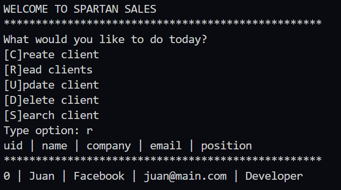

# CRUD Python

SPARTAN SALES CRUD

## Description
This code contains a simple CRUD program

See changes with the files history

* main.py  CRUD based on Strings
* main2.py CRUD based on Lists
* main3.py CRUD with Dictionaries
* main4.py CRUD with Data Persistence in CSV
* pv.py CRUD final start program with terminal interpreter and POO

## How to Run

For build simple main.py and previous versions run this on terminal
```bash
python main.py
```

Change [x] for the advanced version for this program
For build main[x].py run this on terminal
```bash
python main[x].py
```

### Preview

<div align="center">
  
  <small><p>Program</p></small>
</div>

***

## How to run Final Version

Execute this for install in terminal

```bash
python -m venv env
cd /env/Scripts/activate
pip install click
pip install --editable .
```

### Code structure

* setup.py - Instalable in command line
* pv.py - Entry point program
* clients/commands.py - CLI Interface
* clients/services.py - Program logic
* clients/models.py - Interaction Objects

### Commands

Help commands

```bash
pv --help
pv clients --help
```

Create a client
```python
pv clients create
```

List a clients
```python
pv clients list
```
